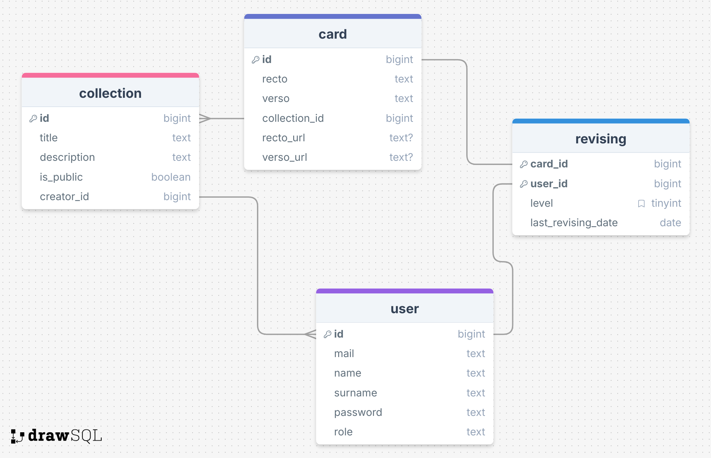

# Flashcard API

https://clementcatel.notion.site/R5-05-Projet-de-groupe-2ae3b8266dbb8014b0aac3869c316f7c

## Database

### Schema

### Initialize the database

Run ``npm run db:push``, then ``npm run db:seed``

If you want a GUI for your db, run ``npm run db:studio``

.env
DB_FILE=file:local.db

