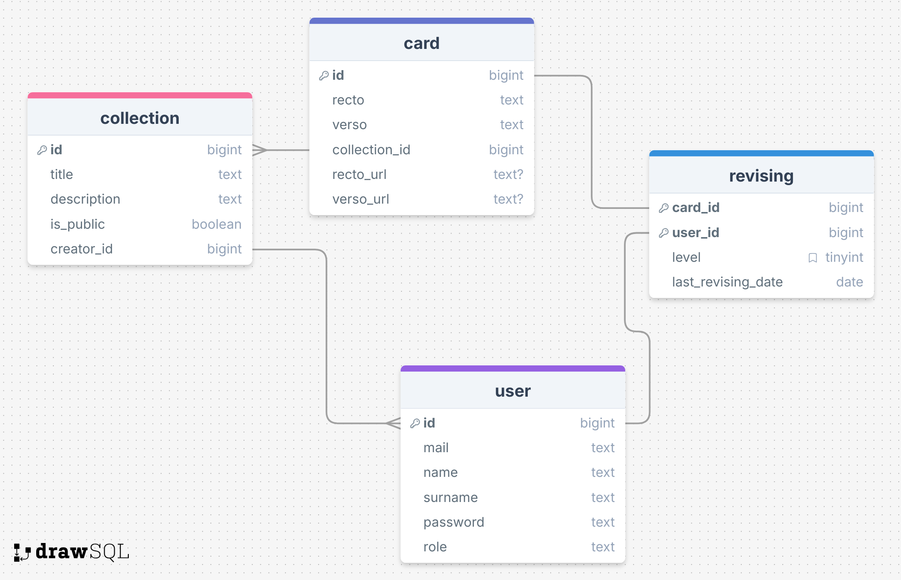

# Flashcard API

<https://clementcatel.notion.site/R5-05-Projet-de-groupe-2ae3b8266dbb8014b0aac3869c316f7c>

## Database

### Schema



### Initialize the database

Run ``npm run db:push``, then ``npm run db:seed`` if you want to initialize it with data.

If you want a GUI to manage your database, run ``npm run db:studio`` and go to <https://local.drizzle.studio>.

## Usage

To install the server : run ``npm install``, then copy ``.env.example`` into a ```.env`` file. Finally, initialize the database.

You can launch the server with ``npm run dev``. Bu default it will be listening on port 3000, but you can change that using environment variables

## Documentation

### Collections

* GET ``/collections`` : return your collections

* GET ``/collections/{id}`` : return the collection with the id. It needs to be public or yours.

* GET ``/collections/search/{querry}`` : return collections with a title that contains the querry.
It will either be public collections or your collections.

* POST ``/collections`` : create a collection.

You need to provide this body (is_public is optional, it can be either 0 (false) or 1 (true)):

```json
{
    "title": "My collection",
    "description": "this is my personal collection of cards",
    "is_public": 1
}
```

* DELETE ``/collections/{id}`` : remove the collection from the database. It will delete every cards in this collection.

* PATCH ``/collections`` : update the collection with the provided informations.

You need to provide this body (besides the id, every field is optional):

```json
{
    "id": "col-id",
    "title": "new title",
    "description": "put a new description here",
    "is_public": 0
}
```

### Cards

* GET ``/cards/{id}`` : return the card with the id.

* GET ``/cards/from-collection/{id}`` : return every cards from the collection.

* POST ``/cards`` : create a card.

You need to provide this body :

```json
{
    "collection_id": "id of the card's collection",
    "recto": "put your question here",
    "verso": "put the response here",
    "recto_url": "put an image url, optional",
    "verso_url": "put an image url, optional"
}
```

* DELETE ``/cards/{id}`` : remove the card from the database.

* PATCH ``/cards`` : update the card with the provided informations.

You need to provide this body (every field beside the id is optional, put only those you want to patch) :

```json
{
    "id": "card-id",
    "recto": "put your question here",
    "verso": "put the response here",
    "recto_url": "put an image url",
    "verso_url": "put an image url"
}
```

### Revising

* POST ``/revisings/{card-id}`` : register a revising for the card corresponding to the id, and update the revising level

### Authentication

* POST ``/auth/register`` : create your account.

You need to provide this kind of body :

```json
{
    "mail":"bob@example.com",
    "name":"Bob",
    "surname":"Brown",
    "password":"example123"
}
```

* POST ``/auth/login`` : connect you to your account.

You need to provide this kind of body :

```json
{
    "password":"example",
    "mail":"alice@example.com"
}
```

### Users

You need to be an **administrator** to use theses routes.

* GET ``/users/`` : return every users.

* GET ``/users/{id}`` : return the user with the id.

* DELETE ``/users/{id}`` : remove the user from the database.
It will remove every private collections the user made, but not the public ones.
